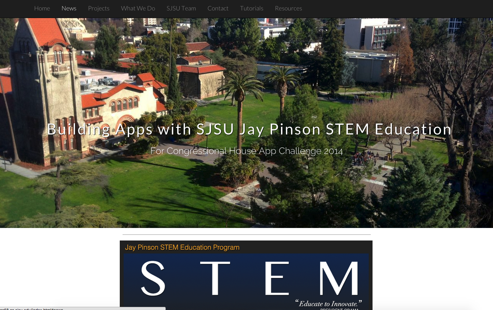
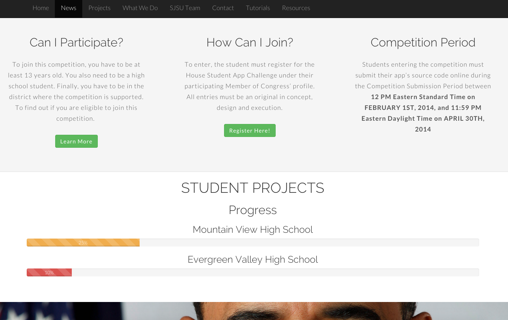
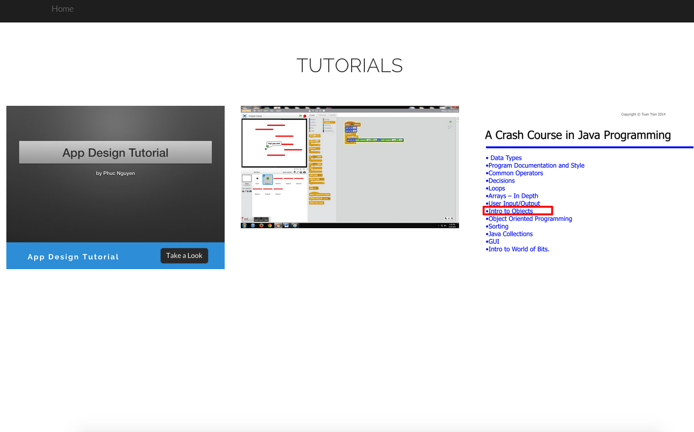

# SJSU STEM Website for Congressional House App Challenge 2014
The website was built for high school students and SJSU students to coordinate for Congressional House App Challenge 2014

### Some screenshots:

#### Main Page

#### News Section

#### Student Progress

#### Tutorial Page

